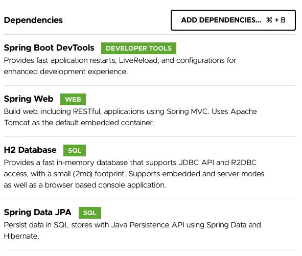
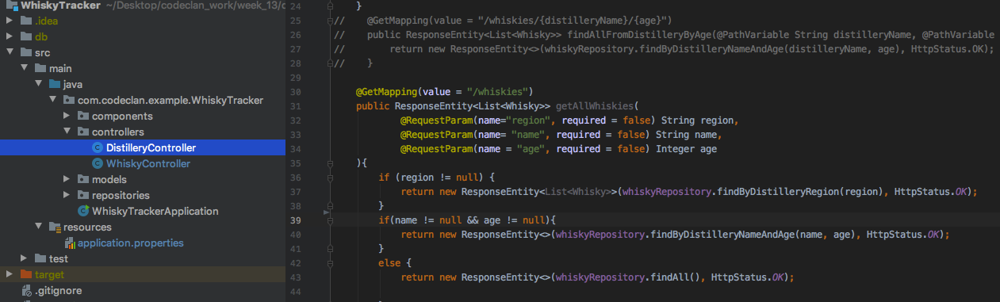

During the Java module at CodeClan we were building Spring Boot apps to serve API to the front end framework, building models and controllers to be able access it on http://localhost:8080 and see json formatted data.  
I wanted to make the API built this way to be available online.  
Great source of knowledge in this matter was an [** article **](https://medium.com/swlh/build-deploy-a-rest-api-from-scratch-using-spring-boot-and-aws-ecs-eb369137a020) by Bowei Han. Step by step explains how to create a simple Spring Boot app, create an account on AWS, create the Docker image of the app and push it to ECS.  
Because steps ** 1 ** and ** 2 ** of his tutorial cover creating a simple Spring Boot app (without H2 or JPA dependencies) I needed to do small changes in files prior to creating the Docker image.  
I would highly encourage you to follow his guidance at step: ** 3 **, ** 4 ** and ** 5 **.  
Dependencies used to created starter from [https://start.spring.io/](https://start.spring.io/) :

With controllers and DataLoader

Resources/application.properties file should look like this:  
``` java
# the application itself
server.port = 8080

# the datasource
spring.datasource.url = jdbc:h2:mem:tmpdb;DB_CLOSE_DELAY=-1;DB_CLOSE_ON_EXIT=FALSE
spring.datasource.driverClassName = org.h2.Driver

# jpa/hibernate
spring.jpa.show-sql = false
spring.jpa.hibernate.ddl-auto = update
spring.jpa.hibernate.naming-strategy = org.hibernate.cfg.ImprovedNamingStrategy
spring.jpa.database-platform = org.hibernate.dialect.H2Dialect

logging.level.root=INFO
logging.path = /var/log
```
After updating application.properties remember to run Maven lifecycle `clean`, `install` and `build` ;)

What next? ** Docker **  
You need to install [Docker Desktop](https://docs.docker.com/engine/install/) or [Docker ToolBox](https://docs.docker.com/toolbox/toolbox_install_mac/) (for older Mac).  
To check if docker has been installed run in the terminal: `docker version` or `docker info`  
At the beginning I was getting error
``` shell
Client: Docker Engine - Community
 Version:           19.03.1
 API version:       1.40
 Go version:        go1.12.5
 Git commit:        74b1e89
 Built:             Thu Jul 25 21:18:17 2019
 OS/Arch:           darwin/amd64
 Experimental:      false
Cannot connect to the Docker daemon at unix:///var/run/docker.sock. Is the docker daemon running?
```
After spending 2h on stackoverflow to find a solution for this error I figured out that I just needed start Docker and the easiest path to it Applications/Docker/Docker Quickstart Terminal ...  
So when everything is up and running - ** what is Docker **?  
Docker is a tool designed to make it easier to create, deploy, and run applications by using containers. Containers allow a developer to package up an application with all of the parts it needs, such as libraries and other dependencies, and deploy it as one package.  
To pack application into Docker image we need a Dockerfile in the root of app (new file, Dockerfile, no extension, capital letter D)

The file should contain information needed to mirror the localhost environment inside Docker and commands to assemble the build. The file for app using Java 8 should look like this:

``` 
FROM openjdk:8-jdk-alpine

RUN addgroup -S spring && adduser -S spring -G spring
USER spring:spring
# Specify JAR location
ARG JAR_FILE=target/*.jar
# Copy the JAR
COPY ${JAR_FILE} app.jar
VOLUME /tmp
EXPOSE 8080
# Set ENTRYPOINT in exec form to run the container as an executable
ENTRYPOINT ["java","-jar","/app.jar"]
```
I came across [Dockerfile Generator](https://www.startwithdocker.com/) that when installed and ran in the root of the app generates Dockerfile or Docker-compose file based on framework and its dependencies. I think I will be using it in the future!  

Now all that is left is to build an image from command line:  
``` $ docker build -t whiskies ```  
``` $ docker images ``` should show list of repositories with one of them called whiskies.  
More docker commands can be found [here](https://docs.docker.com/engine/reference/commandline/docker/)  


And now you can jump back to Bowei’s tutorial and carry on linking Docker with AWS, pushing whiskies image to ECR and deploying it on ECS.  
** Or you can use my just deployed API to fetch data for 22 whiskies and 13 distilleries in Scotland **  
[http://3.10.55.182:8080/whiskies](http://3.10.55.182:8080/whiskies)  
[http://3.10.55.182:8080/distilleries](http://3.10.55.182:8080/distilleries)  
[http://3.10.55.182:8080/whiskies?region=Highland](http://3.10.55.182:8080/whiskies?region=Highland)  
etc etc
