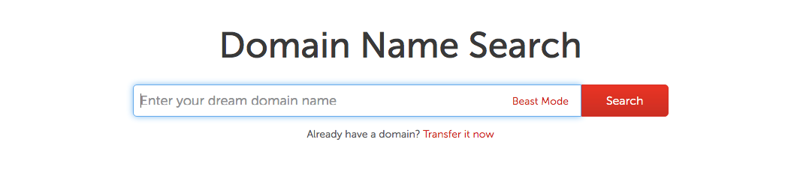
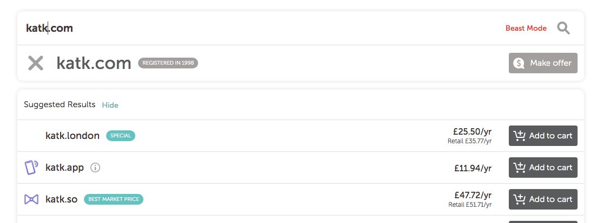

During career week we were told: it is good to link your personal website on CV and LinkedIn profile. But where to start??  

I was recommended [** namecheap **](www.namecheap.com) and this tutorial will explain step by step buying and setting up domain via namecheap services. But there are dozens of similar domain name registrars: Domain.com, bluehost, HostGator, Godaddy. They all allow to purchase and register domain name.  
### The Name
Very difficult indeed to choose the right one, not too long, not too complicated with fancy and catchy domain:  
`www.katarzynakmiotek.com` - who can spell it right?
`www.kk.com` - I would rather not!  
let’s go with `www.katk.com` search:  

Unfortunately that was is already taken and however have an option to make offer to someone who bought it in 1998 I will use one of namecheap suggestions  

** www.katk.dev ** £11.97 per year  
The important thing to look here is the price. By the brief look at other domain name registrars they might be providing price per month, per year or very cheap first year and triple the price for every next. Be careful.  

### Add to basket
Choose the right one and add to cart. On the right hand-side in the basket except domain charge is also ICANN (The Internet Corporation for Assigned Names and Numbers) mandatory small fee £0.18.  
Moving to shopping cart there are few key points here. You can select how many years you want to register domain for - I choose one year. Good I guess is to tick ** auto-renew ** box, your card will be charged automatically and won’t be any gap in you owning it- what I mean nobody will be able to buy it and then try to resell to you (possibility that my domain will be that popular one day …)   
** WhoIsGuard ** keep it enabled prevents your personal data be public.  
** Premium DNS ** didn’t think is needed for my website.  
Create account. Pay with your card/ PayPal. Make sure you won't auto renew Premium DNS (If as me don't need it).  

### What next?
Verify email, email from CEO

