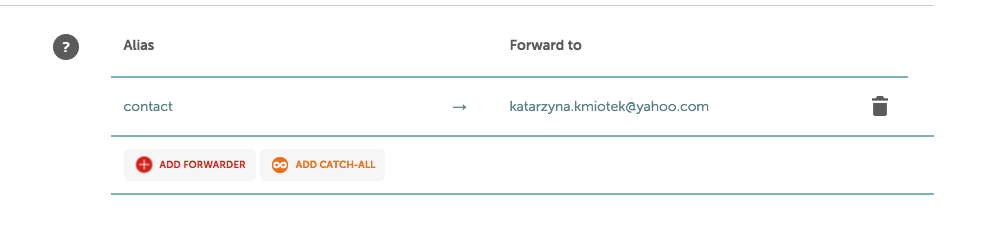
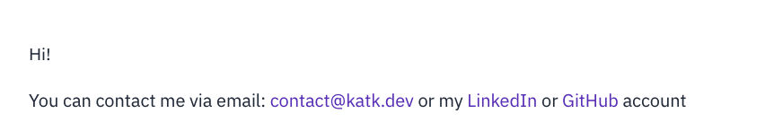

During career week we were told: it is good to link your personal website on CV and LinkedIn profile. But where to start??  

I was recommended [** namecheap **](www.namecheap.com) and this tutorial will explain step by step buying and setting up domain via namecheap services. But there are dozens of similar domain name registrars: Domain.com, bluehost, HostGator, Godaddy. They all allow to purchase and register domain name.  
### The Name
Very difficult indeed to choose the right one, not too long, not too complicated with fancy and catchy domain:  
`www.katarzynakmiotek.com` - who can spell it right?
`www.kk.com` - I would rather not!  
let’s go with `www.katk.com` search:  

Unfortunately that was is already taken and however have an option to make offer to someone who bought it in 1998 I will use one of namecheap suggestions  

** www.katk.dev ** £11.97 per year  
The important thing to look here is the price. By the brief look at other domain name registrars they might be providing price per month, per year or very cheap first year and triple the price for every next. Be careful.  

### Add to basket
Choose the right one and add to cart. On the right hand-side in the basket except domain charge is also ICANN (The Internet Corporation for Assigned Names and Numbers) mandatory small fee £0.18.  
Moving to shopping cart there are few key points here. You can select how many years you want to register domain for - I choose one year. Good I guess is to tick ** auto-renew ** box, your card will be charged automatically and won’t be any gap in you owning it- what I mean nobody will be able to buy it and then try to resell to you (possibility that my domain will be that popular one day …)   
** WhoIsGuard ** keep it enabled prevents your personal data be public.  
** Premium DNS ** didn’t think is needed for my website.  
Create account. Pay with your card/ PayPal. Make sure you won't auto renew Premium DNS (If as me don't need it).  

### What next?
Now few emails should arrive to your mailbox: welcome from CEO of namecheap, payment confirmation and domain verification email. The last one requires more attention as it the key to have your domain up and running in 24-48h. I didn’t receive it straight away so had to:
go to my namecheap account
select domains from the left sidebar
and there click on verify contact button
Verification email will be resent so just click in it to confirm details 

### Email? Why not
namecheap offers two solutions for customers wanting to have email address/es with their domain name. This definitely looks more professional and makes it a good branding practice.  
** Private email: **  
It is a paid service (£7/year) is a cloud-based open-source collaboration software that meets all necessary email, calendar and contacts, tasks management and document storage needs. But it’s paid feature.  
** Email forwarding: **  
The service I decided to set up for my domain as apart that is ** free ** meets my current needs. I don’t expect at the moment too much traffic here so linking domain email address with my private one has more sense. How to set it up?  
In account dashboard select ** Domain List ** from the left sidebar. On a right hand side on chosen domain  click ** manage **  and scroll down on domain features to ** email forwarding **

As an ** Alias ** you can put anything you want `info`, `KatarzynaKmiotek`, `contact` etc.   
** Forward to ** it is a email mailbox you want to receive emails sent to domain email.   
Feature should be available within 30 min (can take longer). Testing it by sending email from _ forward to _ email may not work.  
  
And here it is!

### Support  
Waiting for domain to be set up can take good few days.
Namecheap has a great support team available for live chat 24/7 if waiting time is too long.

