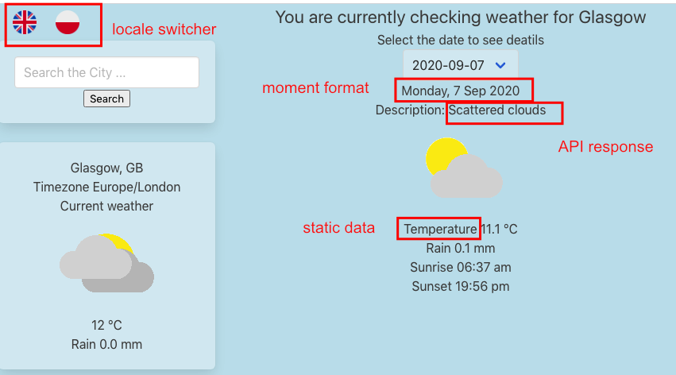

I am bilingual and wanted my apps to be accessible in two languages. I had this idea during my first solo project at CodeClan. Wanted to define routes that lead users to different content pages, it would be so much unnecessary files and code. I came across ** SmashingMagazine ** article last week about using ** i18n ** in Vue app. When I heard about it before I got the impression that this amazing package translates websites for me. Well, not really but separates different language contantent in a definitely more elegant way that I was planning to do.  
I18n stands for _ internationalization _ where 18 is a number of letters between ** i ** and ** n **. (Hard to say if the shortcut or full word is a better tongue twister… ) It is a process of designing software that can be easily adapted to various languages without engineering changes.  
Timi Omoyeni explained [here](https://www.smashingmagazine.com/2020/06/internationalization-vue-i18n/) detailed how to use it.  
Simply run   
`vue add i18n`  
This will add some additional files to your folder tree .env, i18n.js, Helloi18n.vue and locales folder all to show how to use this package. Files in the _ locales _ folder (en.json, pl.json etc) are responsible for storing translation in simple JSON format. The key will be used in the code and automatically substituted with a proper value based on the chosen language.  
pl.json: 
``` json
{
   "daysList": {
       "header": "Wybierz datę, aby zobaczyć szczegóły"
   },
   "dayDetails": {
       "description": "Opis:",
       "temperature": "Temperatura",
       "rain": "Deszcz",
       "sunrise": "Wschód Słońca",
       "sunset": "Zachód Słońca"
     },
```
en.json: 
``` json
{
 "daysList": {
     "header": "Select the date to see details",
 },
 "dayDetails": {
   "description": "Description:",
   "temperature": "Temperature",
   "rain": "Rain",
   "sunrise": "Sunrise",
   "sunset": "Sunset"
 },
```
 To access it from vue component use $t function:
```html
<template lang="html">
<div>

<h2>{{ $t('daysList.header')}}</h2>
  <div class="select">
```
When locale is set to ‘en’ this will return “Select the date to see details” and when locale is set ‘pl’ "Wybierz datę, aby zobaczyć szczegóły"  
Switching locale is a feature available for user who can change displayed language during any point of browsing the app. Ilya Bodrov-Krukowski explains [here](https://lokalise.com/blog/vue-i18n/) step by step shows how to create a new vue component ** LocaleSwitcher ** to allow users to select language.  


This is enough to have static data available in two languages but I was facing other challenges:  
a) for date formatting I am using Moment library  
b) Incoming weather data is in English  



** Momentjs **  
Once you start to use Moment in JavaScript you don’t want to go back to an old way of dealing with date format. It is very simple to use and allows parsing, validating, manipulating and displaying date/time in a human readable way. By default moment formats data in English (‘Monday, 7 Sep 2020). I was over the moon when found in [documentation](https://momentjs.com/docs/#/i18n/) that Moment supports i18n by moment.locale()  
Great! But same as the group of developers on Stackoverflow I struggled to understand how to use it. Long walk, fresh yerba mate and figured out that need to create custom moment.locale(‘pl’) file:
```js
import { locale } from 'moment';
locale('pl', {
        monthsShort : 'sty_lut_mar_kwi_maj_cze_lip_sie_wrz_paź_lis_gru'.split('_'),
        weekdays : 'niedziela_poniedziałek_wtorek_środa_czwartek_piątek_sobota'.split('_'),
        weekdaysShort : 'nie_pon_wt_śr_czw_pt_sb'.split('_'),
        weekdaysMin : 'N_Pn_Wt_Śr_Cz_Pt_So'.split('_'),
        longDateFormat : {
            LT : 'HH:mm',
            LTS : 'HH:mm:ss',
            L : 'DD.MM.YYYY',
            LL : 'Do MMMM',
            LLL : 'D MMMM YYYY HH:mm',
            LLLL : 'dddd, D MMMM YYYY HH:mm'
        }
    });
```
 And add
```js
       this.moment.locale(locale);
```
To the LocaleSwitcher component in switchLocale method.  


** API response **  
At this point all parts of my app were translated apart from the weather description field that depends on API response. There was no way that I could add all possible translations to a pl.json file and with some logic manipulate it in this way. Luckily _ description _ includes maximum three words so should be easy to translate with help of external API. I found list of free/paid translation [APIs](https://blog.api.rakuten.net/top-10-best-translation-apis-google-translate-microsoft-translator-and-others/)  
And started read their docs, creating accounts, hoping that won’t go over the 50 translated words per day limit (I reached it after 1 hour). And finally decided to go with Systrans translator. Set up a TextTranslator vue component, sending weather description text and getting a translated response back but… As you can imagine there are few ways of translating: “broken clouds” , “light shower”... I wasn’t happy with the result.  
Another walk, fresh yerba mate.  
There needed to be a more elegant way to translate this API… Went back to it’s documentation hoping that it supports other languages. Obviously DOES! About 30 other languages!
Solution was so easy- needed to manipulate fetch method a little:
```js
localeChange() {
     fetch(
       `https://api.weatherbit.io/v2.0/forecast/daily?city=${this.searchCity},
       UK&key=${key}&lang=${this.locale}`
     )
...
```

Here is my weather app available in two languages now.  
[https://weather-app-solo-project.netlify.app/](https://weather-app-solo-project.netlify.app/)


