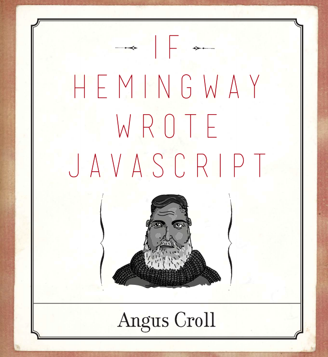
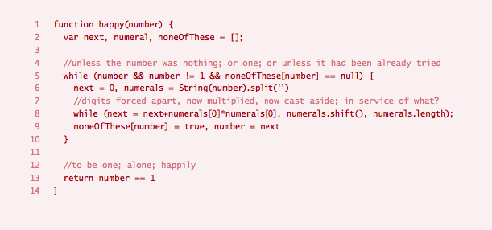
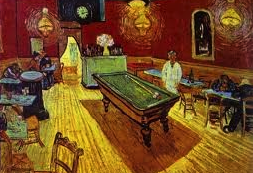
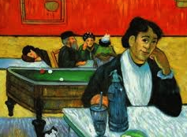

Recently I looked at my two diplomas one from Comparative Literature studies ** Jagiellonian University ** and 
one from Professional Software Development course ** CodeClan **. How different 
they are! First uses language in all its beauty the second one uses syntax for 
communication.  
The book _ If Hemingway wrote JavaScript _ by Angus Croll it's the bridge between 
those two disciplines and truly spectacular comparative work.

I know little about literature and very little about JavaScript but here are my thoughts about recent read.  
The book is a treat itself. Beautiful design and illustrations make me reach for it every evening. 
Recently I deserve a treat!  
Book is split in five sections separated with _ Poetic Interludes _. It seems that each part is a 
Codewars challenge that writers were asked to solve:  
** The Fibonacci sequence ** is assigned to Ernest Hemingway, William Shakespeare, Andre Breton, 
Roberto Bolano and Dan Brown.  
Jack Kerouac, Jane Austen, Samuel Johnson, Sir Arthur Conan Doyle and James Joyce were asked to write 
** The Factorial ** program.  
J.D. Salinger, Tupac, Virginia Woolf, Geoffrey Chaucer and Vladimir Nabokov helped with ** The Happy 
Numbers **.  
Jorge Luis Borges, Lewis Carroll, Douglas Adams, Charles Dickens and David Foster Wallace worked on a 
function that returns ** Prime Numbers **.  
Probably my favourite dev team: Sylvia Plath, Italo Calvino, J.K. Rowling, Arundhati Roy and Franz Kafka 
solved the ** Say It ** function.  
Each chapter opens with illustrations (caricature) and paraphrases of the writer's famous quote 
(Virginia Woolf: _ A woman must have money and a room of her own if she is to write JavaScript _). 

Then on one page or two author describes characteristics of the writer's style, mentions life story, 
and quotes paragraphs of work.  It is unbelievable how much research was needed to write those couple 
of pages, how many hours spent in the library and how many consultations were required. This little bio 
is nothing like a wiki page. Makes the reader (me) go and read more about the Beat Generation, 
Sherlock Holmes or even watch a movie about Tupac. The next page is a part with a coding solution. 
Few lines of JavaScript are the essence of writer’s style - mirror language in naming convention, 
copy interpunction and comment section, code even has the same rhythm. Every solution is different, 
uses different features of JS (closure, recursion, callback, vanilla JavaScript) depending on writer style.  
Happy Numbers by Virginia Woolf:

Author then talks through the presented code, explains what the writer wanted to achieve, why it didn't
work, or why it worked as the artist wanted it to.  

I laughed a lot while reading this book and learned a lot about famous writers and JavaScript.

The book made me think about a few things: developer as an artist and relations between JS and literature;
will comparative literature ever include programming language as a type of art?  
Very often artists decide to choose the same subject of their artwork. Approaching it with their own 
painting style, focusing on different features, so the same landscape tells the unique story. The 
example that comes to my mind is _ The Night Cafe at Arles _ painted by two famous expressionists Vincent 
van Gogh: 

and Paul Gauguin:

Does Angus Croll say that developers are artists too?

I know a little about the literature and a little about the art. The title of my dissertation was: 
_ Ekphrasis is Stanislaw Grochowiak’s selected poems _. I have made a detailed analysis of his ekphrasis 
and compared them with paintings that relate to. Compared structures, composition, colour palette, 
story that both tell.  

I would comapre JavaScript to ancient greek tragedy,
that respects unity of _ action_,_ time _ and _ place _ (with exception when uses web browser APIs).
The action takes place in a global thread of execution, personas are declared in global memory at the
beginning of the play, then each execution context (Act) happens with local memory characters declared. 
Stasimas, known as the choir’s comments are the developer's explanation of the situation. JavaScript is 
single-threaded, the same as the plot in greek play, driven by fate. Once finished executing, all get 
destroyed.  

After discovering this book I am even happier that in May I decided to change my career.

