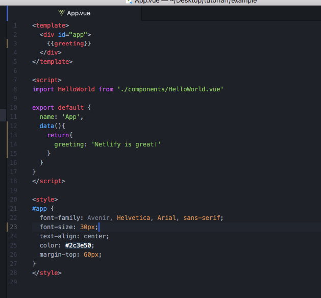
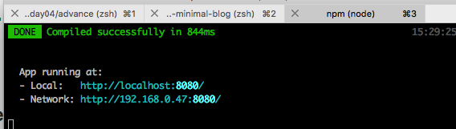
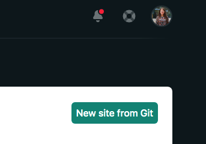
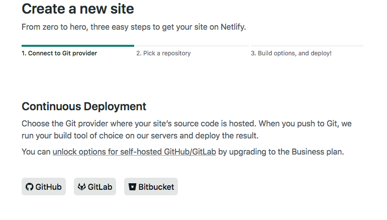
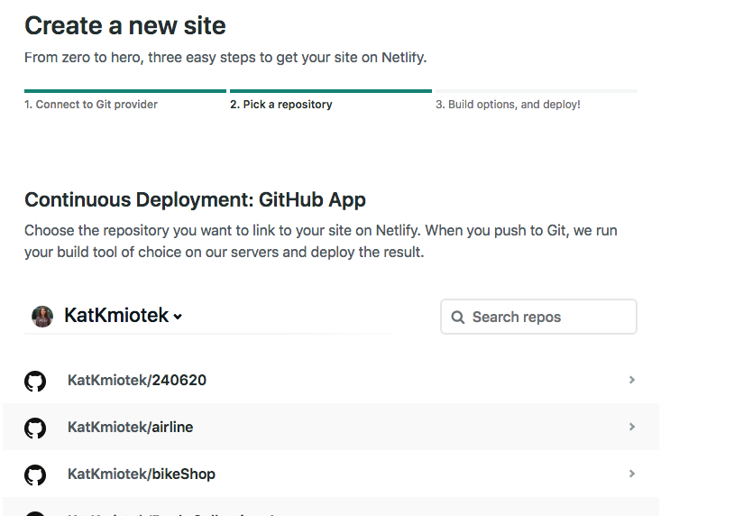
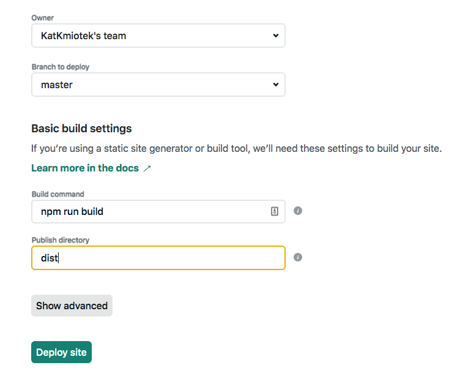
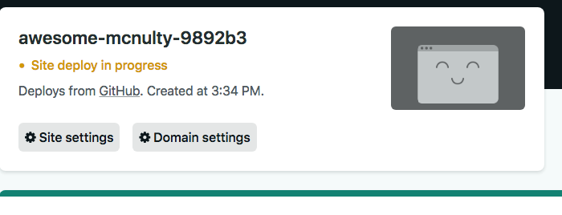
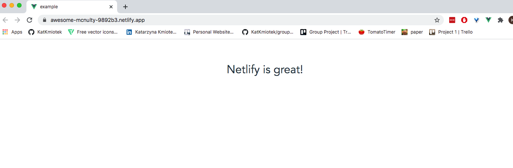
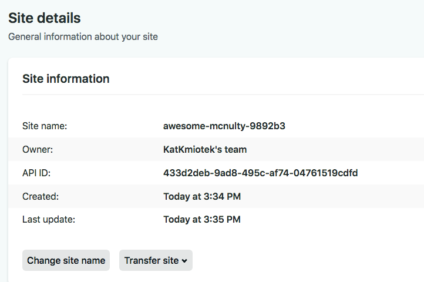

### Netlify and I
After submitting my first project after 5th week of CodeClan course was looking for ways to deploy my app. Mainly to share it with friends and proudly say: Look what I have made after few weeks of coding experience.  
I found Heroku.  
I found GitHub Pages.  
I found CodeDeploy on AWS.  
But then ** Netlify ** appeared in my life making deployment easy and quick as making peanut butter and jelly toast. 
Netlify is computing company that offers hosting and serverless backend services for web applications and static websites. Has many, many features (like testing, like being part of Jamstack) but so far I discovered ** deployment **.  
What makes it different from other competitors is that is very user friendly. Creating account and linking it with one of version control (GitHub, GitLab, GitBucket) takes just couple minutes. Deploying app takes about 5 min and you just need repository with ready to _ build _ app.
### Let’s start with simple Vue app  
 ```
 npm install -g @vue/cli  
 vue create example  
```
Having basic code like this:  
  
And Running on localhost:8080


You can now push it to GitHub repository.

### Back to Netlify account  
Once successfully logged in click on button in right top corner:

And select version control you are using

Then search for repository and pick `example` one.

In building settings use build command that applies (as per package.json) here : `npm run build` and location that will be created once build `dist`   

Now few minutes waiting….

And app is running on Netlify domain  

Domain name is assigned randomly but it easy can be changed in site settings  


** THATS IT! Easy? **  
The best part of it is that Netlify provides ** Continuous Integration ** and ** Development ** so all changes to your app push to GitHub will be automatically applied to domain. Being honest I can’t even imagine how problematic was devs life before this feature became a must.
